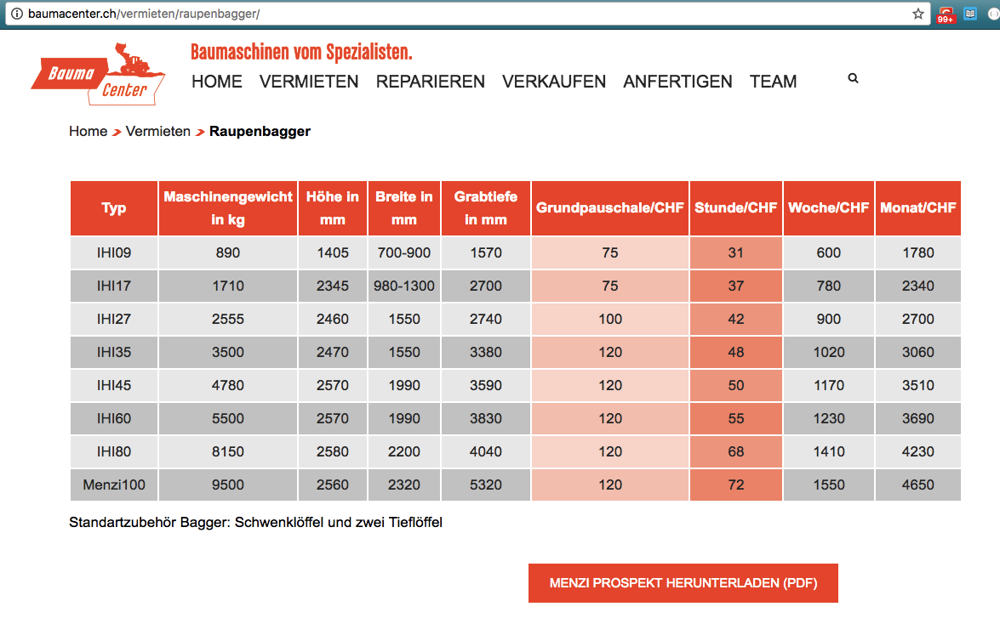
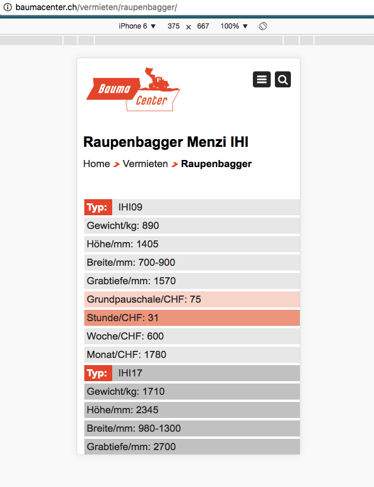

### Absolutely responsive tables

Table responsivity done through switching to vertical table and displaying the table headings via a ::before pseudoelement above each set of values.

```
@media (max-width: 490px) {
th {display: none;}
td {display: table; width: 300px;}
td:nth-of-type(1):before {content: "Name: ";}
td:nth-of-type(2):before {content: "Anschrift: ";}
td:nth-of-type(3):before {content: "Firma: ";}
td:nth-of-type(4):before {content: "Land: ";}
}
```





